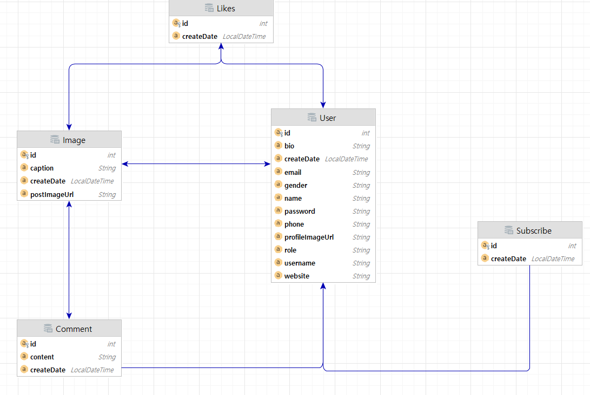

# 포토그램 - 인스타그램 클론 코딩

### Springboot + JPA를 이용한 SNS 웹사이트 프로젝트

###[데어프로그래밍] 스프링부트 SNS프로젝트 - 포토그램 만들기 인강참고
https://easyupclass.e-itwill.com/course/course_view.jsp?id=27&rtype=0&ch=course

### 프로젝트 소개
- AOP를 활용한 유효성 검사 자동화
- 커스텀 예외 핸들링
- 복잡한 모델 DTO 매핑
- 스프링 시큐리티
- OAuth2.0

### 프로젝트 환경 구성
- JDK 11
- MariaDB 10.7
- Springboot2.6.6
- AOP
- JSP Template Engine
- Maven
- Lombok
- Springboot JPA
- Springboot Security

### 데이터 ERD

 
